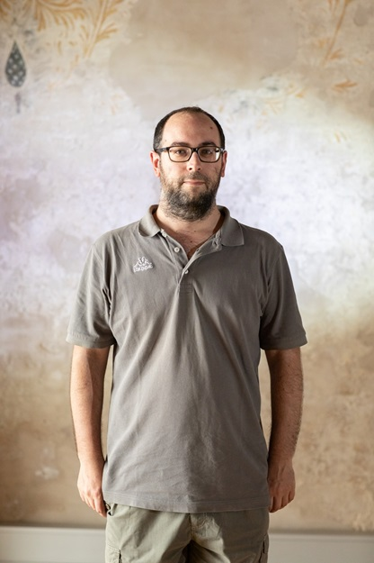
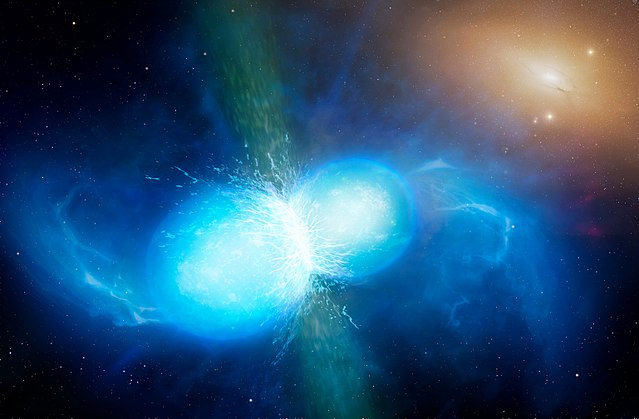
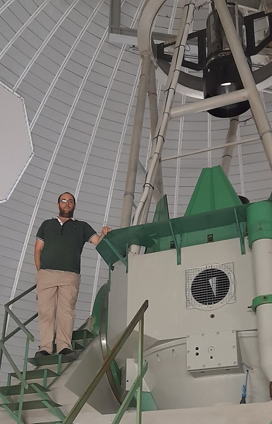
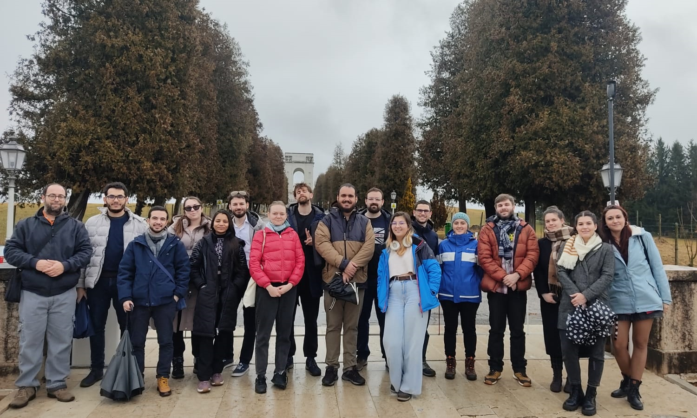
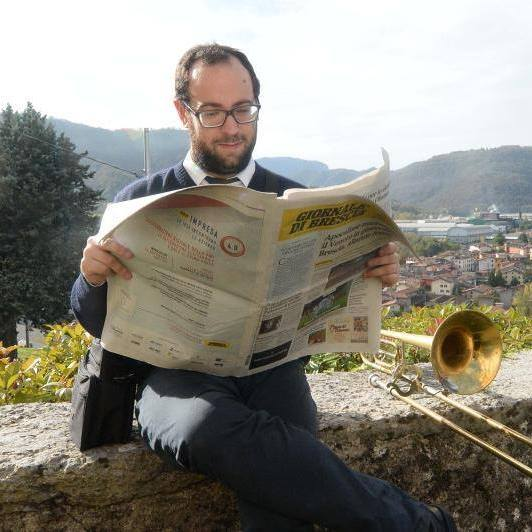

## ABOUT ME
I'm an astronomer, currently a post-doc ("assegnista di ricerca") at the Brera Astronomical Observatory in Merate (LC), Italy.

### Short Biography
I was born in Gavardo (BS), Italy in 1994. I studied at "Liceo Scientifico G. Perlasca" of Idro (BS), Italy, with a final score of 90/100.
In 2013 I started the 3-years Bachelor Degree in Astronomy (Laurea Triennale in Astronomia) at [Padova University](https://www.unipd.it/), Italy, where I graduated in 2016 with a Thesis on Supermassive Black Holes at the center of distant quasars, under the supervision of Dr. Stefano Ciroi.
Then, I started the 2-years Master Degree in Astronomy (Laurea Magistrale in Astronomia) also at Padova University, and I graduated in 2018 with a Thesis on the interacting Supernova (see below) SN 2013gc, under the supervision of Dr. Andrea Pastorello.
In 2019 I started the 4-years PhD in Astrophysics (Dottorato in Astrofisica) under the supervision of Prof. Giuliano Pignata at Universidad Andres Bello in Santiago, Chile, where I lived for about one year, even though I spent most of the PhD in Padova (also because of the restrictions due to the Covid-19 pandemic), hosted by the local INAF (Istituto Nazionale di Astrofisica) Astronomical Observatory. 
I was under the co-supervision of Dr. A. Pastorello, and collaborated with the members of the [Research group on Supernovae](https://sngroup.oapd.inaf.it/about.html) at the Padova Astronomical Observatory ([INAF-OAPd](https://www.oapd.inaf.it/)). I got the PhD title in June 2023. 
In July 2023 I was hired as a Researcher at the Brera Astronomical Observatory ([INAF-OAB](https://brera.inaf.it/)), Italy, working on the search and follow-up observations of electromagnetic counterparts of gravitational waves events, in particular [kilonovae](https://en.wikipedia.org/wiki/Kilonova) (the mergers of 2 neutron stars), within the GRAWITA Collaboration, under the supervision of Dr. Paolo D'Avanzo.
In July 2025 I will start the second post-doc position at INAF-OAPd to work with the new Son of X-Shooter ([SOXS](https://www.eso.org/sci/facilities/develop/instruments/SoXS.html))[^1] spectrographic instrument, that is now mounted at the 3.58-m ESO-NTT telescope at La Silla Observatory, Chile.

Here you can find a [link to my CV](./Curriculum_Vitae.pdf "My CV").

# RESEARCH
My research field belongs to the Time Domain Astronomy. I study transients, astrophysical phenomena with a short (referred to human timescales) and limited duration, from days to a few years.
My main focus is on [Supernovae](https://sngroup.oapd.inaf.it/supernova_intro.html) (SNe), the luminous and energetic explosions that mark the end of lives of massive stars.
In particular, I'm interested in 'interacting' SNe, in which the fast (about 10,000 km/s) SN ejecta collide with pre-existing, slow (some hundreds of km/s) circumstellar medium, produced by the progenitor star during previous episodes of mass loss, and they 'interact'. The interaction is efficient in converting the kinetic energy of the ejecta into radiation, making interacting SNe more luminous for a longer time with respect to a normal SN.
On the side, I also developed an expertise in the field of Gap Transients, events with a luminosity intermediate between Classical Novae and normal Supernovae, that encompass a variety of astronomical phenomena at the extremes of stellar variability, including: 'failed' and Electron-Capture SNe, mergers of non-compact stars in binary systems, pre-SN outbursts from their progenitors, and Giant Eruptions from Luminous Blue Variable stars.
Occasionally I even observed some comets[^2].

I work with researchers from different countries: Spain, Ireland, UK, Denmark, Germany, Chile, China. I'm an active member of international collaborations devoted to the study of transients, including [PESSTO](https://www.pessto.org/), [NUTS](https://nuts.sn.ie/), [GRAWITA](https://grawita.inaf.it/), [ENGRAVE](http://www.engrave-eso.org/) and [LSST/TVS](https://lsst-tvssc.github.io/).

I'm an expert user of the telescopes and instrumentation of the [Asiago Astrophysical Observatory](https://www.oapd.inaf.it/sede-di-asiago), which consists of the Pennar and Mount Ekar observing stations.
The Pennar station hosts the 'Galilei' 1.22-m telescope; when inaugurated in 1942 it was the largest operating telescope in Europe.
The Mount Ekar 'L. Rosino' station hosts the Schmidt 67/92-cm and the Copernico 1.82-m telescopes. The latter, inaugurated in 1973, is currently the largest telescope on the Italian soil.

I work with data (astronomical images and spectra) from some of the largest optical/near-infrared telescopes hosted in the major astronomical observatories in the world. Those include: LT, NOT, TNG, GTC (all located on La Palma island), REM, NTT, VLT (located at La Silla and Paranal observatories in Chile). Some of them are available to us through our international collaborations.
I also work on imaging data from some space telescopes, including _HST_, _JWST_ and _WISE_ for the Infrared, _Swift_ and _GALEX_ for the Ultraviolet.

My expertise in data handling extends in the electromagnetic domains from Far-Ultraviolet (FUV) to the Mid-Infrared (MIR), passing through the Near-Ultraviolet (NUV), the Optical and the Near-Infrared (NIR), i.e. from 0.2 to 20 µm.

# PUBLICATIONS
Until now, I wrote 6 peer-reviewed scientific articles as first author, and I am a co-author of more than 60 papers.
In addition, I published more than 200 non-refereed publications (Astronomer Telegrams, AstroNotes, Transient Classification Reports etc.), also as the leading author.
I got more than 1100 citations, with an H-index of 19.

[Link to my Publications in ADS](https://ui.adsabs.harvard.edu/public-libraries/in38wuqjTi6qO-OZzVnzQA "My Publications in ADS")

[Link to my ORCID Page](https://orcid.org/my-orcid?orcid=0000-0003-4254-2724 "My ORCID page")

## PROFESSIONAL SERVICE
I refereed papers submitted to _MNRAS_, _ApJ_ and _A&A_. I was member of the TAC of the TNG telescope for semesters 2023A and 2024B.
In June 2023 I was member of the LOC of the _Copernico @50_ workshop in Asiago.
In July 2024 I was a volunteer at the 2024 European Astronomical Society Annual Meeting in Padova.
In March 2025 I was member of the LOC of the _Celebrating 20 years of Swift Discoveries_ conference in Florence.
I was a member of the LOC of the conference "An Extraordinary Journey Into The Transient Sky: from restless progenitor stars to explosive multi-messenger signals" which was held in Padova on 1-4 April 2025.

In February 2024 I was a tutor at the [2023 NEON Observing School](https://www2.mpia-hd.mpg.de/~korhonen/ORP_training/NEON2023/) for PhD students.

Since June 2024 I'm a Junior Member of the International Astronomical Union ([IAU](https://iau.org/Profile?ID=42146)).
Since July 2024 I'm a member of the Coordinamento Italiano Burst Ottici (CIBO) Collaboration, for the optical follow-up of Gamma-Ray Bursts and other high-energy transient events.

## OUTREACH (in Italian)
Da Novembre 2021 in modalità remota, e dall'estate 2022 in presenza, ho fatto da tutor alla scuola estiva [ASYAGO](https://schools.dfa.unipd.it/ASYAGO/) per liceali presso l'Osservatorio Astrofisico di Asiago.
Ho collaborato alla realizzazione della Notte Europea dei Ricercatori (European Research Night) delle ultime 4 edizioni presso la Specola dell'Osservatorio Astronomico di Padova.
Dall'autunno 2022 ho iniziato a tenere conferenze di astronomia ed incontri al pubblico, incluse serate osservative del cielo stellato.

## MISCELLANEOUS (in Italian)

- Suono il trombone da circa 15 anni in varie bande sinfoniche.
- Sono membro stabile della [Filarmonica Conca d'Oro Valle Sabbia](https://filarmonicaconcadoro.it/it/).
- Mi piace la musica classica e per banda, ma non disdegno altri generi (ABBA, De André, Morricone, TSFH, Vangelis, Il Volo).
- Mi piace la cucina italiana.
- Adoro i gatti.

# CONTACT
I'm active on social media, primarily in Italian ([Instagram](https://www.instagram.com/andreareguitti/) and [Facebook](https://www.facebook.com/andrea.reguitti)).

You can contact at one of my e-mails:
- The institutional one (for work): andrea.reguitti@inaf.it
- Or the more 'general' one (for public use): andreareguitti@gmail.com
  
----------------------------------------------------------------------

[^1]: <http://www.brera.inaf.it/~campana/SOXS/Son_of_X-Shooter.html>
[^2]: <https://it.m.wikipedia.org/wiki/File:C2022_E3-_Andrea_Reguitti,_Universit%C3%A0_di_Padova.jpg>
